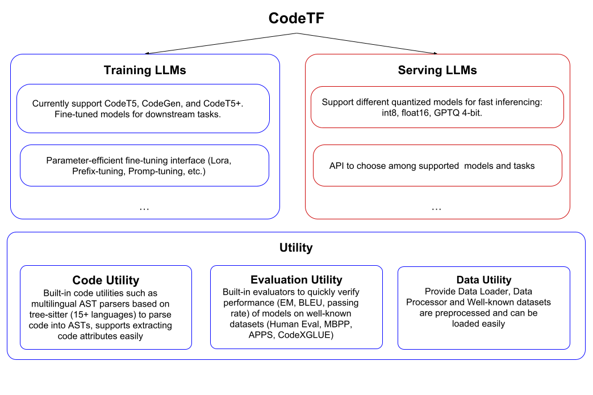
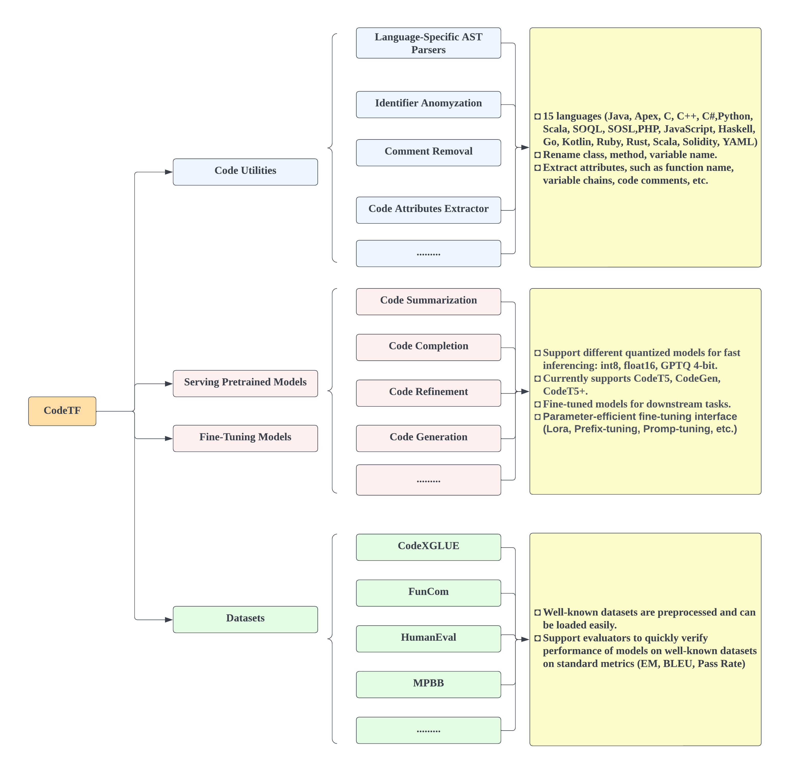

    
<p align="center">
    <br>
    
    <br>
<p>
<div align="center">
  <a href="https://opensource.org/licenses/BSD-3-Clause">
  
  </a>
   <a href="https://www.python.org/downloads/release/python-380/">
  
  </a> 
 
</div>


<div align="center">
<a href="https://arxiv.org/abs/2209.09019">Technical Report</a>,
<a href="">Jupyter Notebook Examples</a>,
<a href="">Blog</a>
</div>

    
# CodeTF - A Comprehensive Transformer-based Library for Code LLM & Code Intelligence
[](https://github.com/bdqnghi/CodeTF_personal/blob/main/LICENSE)
[](https://www.python.org/downloads/release/python-390/)
[](https://github.com/psf/black)
    
## Table of Contents
  - [Introduction](#introduction)
  - [Installation](#installation)
  - [Getting Started](#getting-started)
  - [Other Utilities](#other-utils)
  - [License](#license)

## Introduction
CodeTF is a state-of-the-art deep learning library in Python designed to provide a comprehensive interface for training and inferencing on code intelligence tasks, collectively known as AI4Code. This library encompasses a broad spectrum of tasks, including code summarization, code translation, code generation, and more. Our primary goal is to equip researchers and engineers with a one-stop solution that enables them to seamlessly explore the potential of cutting-edge language models for code. With its intuitive and user-friendly interface, we aspire to facilitate the integration of AI4Code into real-world applications with minimal effort.

As an all-inclusive code intelligence toolkit, CodeTF also offers utilities that allow for effortless manipulation of source code across various programming languages. These utilities enable users to extract code attributes such as function names, comments, identifiers, and variable names. To accomplish this, an Abstract Syntax Tree (AST) parser is essential, and our library leverages tree-sitter as its core parser. To enhance accessibility for our users, we have pre-built tree-sitter libraries into .so files for immediate use, covering programming languages like Bash, C#, C++, C, CSS, ELM, Go, Haskell, HTML, Java, JavaScript, Kotlin, Lua, PHP, Python, Ruby, Rust, Scala, Solidity, and SFApex. This eliminates the need for users to set up these parsers, which can often be challenging. With CodeTF, users can instantly utilize our utilities with ease.

The current version of the library offers:

- **Fast Model Serving**: We support an easy-to-use interface for rapid inferencing with pre-quantized models (int4, int8, int16, float16, mixed int8_float16).
- **Fine-Tuning Your Own Models with Custom Datasets**: We provide an API for quickly fine-tuning your own LLMs for code using SOTA techniques for parameter-efficient fine-tuning (HuggingFace PEFT).
- **Supported Tasks**: nl2code, code summarization, code completion, code translation, code refinement, clone detection, defect prediction.
- **Datasets+**: We have preprocessed well-known benchmarks (Human-Eval, MBPP, CodeXGLUE, APPS) and offer an easy-to-load feature for these datasets.
- **Pretrained Models**: We supply pretrained checkpoints of state-of-the-art foundational language models of code (CodeT5, CodeGen, CodeT5+).
- **Fine-Tuned Models**: We furnish fine-tuned checkpoints for 8+ downstream tasks.
- **Utility to Manipulate Source Code**: We provide utilities to easily manipulate source code, such as user-friendly AST parsers in multiple languages.

The following table shows the supported models with sizes and the tasks that the models support. This is a continuing effort and we are working on further growing the list.
    
| Model      | Size                                      | Tasks                                                                                      |
|------------|-------------------------------------------|--------------------------------------------------------------------------------------------|
| CodeT5     | Small (125M), Medium (220M), Large (770M) | Pretrained, Code Sum, Code Generation, <br> Code Refinement, Defect Prediction, Clone Detection |
| CodeT5+    | 220M, 770M, 2B, 6B, 16B                   | Pretrained                                                                                 |
| CodeGen    | 350M, 2B, 6B, 16B                         | Pretrained                                                                                 |
| SantaCoder | 1.1B                                      | Pretrained                                                                                 |
| StarCoder  | 15.5B                                     | Pretrained                                                                                 |
| GPT        | j (1.3B), j (6B), Neox (20B)             | Pretrained                                                                                 |
| GPT-Neo    | 1.3B                                      | Pretrained                                                                                 |
| BLOOM      | 560M, 1.1B, 1.7B, 3B, 7.1B                | Pretrained                                                                                 |


## Features Overview
    
Below is the overview of the features that we support.
<p align="center">
    <br>
    
    <br>
<p>       
    
## Quick Start
### Install CodeTF:

1. (Optional) Creating conda environment

```bash
conda create -n lavis python=3.8
conda activate codetf
```

2. install from [PyPI](https://pypi.org/project/salesforce-codetf/)
```bash
pip install codetf
```
    
3. Or, for development, you may build from source

```bash
git clone https://github.com/salesforce/CodeTF.git
cd CodeTF
pip install -e .
```

### Inferencing Pipeline
    
The function ``load_model_pipeline()`` is an important function that loads our supported models and tasks. Below is an example on how to use this function to load ``codet5`` models and perform inference on specific tasks (code translation and code summarization in this case). There are a few notable arguments that need to consider:
-  model_name: the name of the model, currently support ``codet5`` and ``causal-lm``. 
-  model_type: type of model for each model name, e.g. ``base``, ``codegen-350M-mono``, ``j-6B``, etc.
-  quantize: the precision level of quantized model, currently support ``int8``. More such as ``int16``, ``float16``, etc., will be supported in the future.
-  quantize_algo: currently support ``bitsandbyte``.
    
```python
import sys
from pathlib import Path
sys.path.append(str(Path(".").absolute().parent))
import torch
from codetf.models import load_model_pipeline

translation_model = load_model_pipeline(model_name="codet5", 
                model_type="base", task="translate", language="java-cs", 
                quantize="int8", quantize_algo="bitsandbyte")

summarization_model = load_model_pipeline(model_name="codet5", 
                model_type="base", task="sum", language="python", 
                quantize="int8", quantize_algo="bitsandbyte")

code_snippets = """
    void bubbleSort(int arr[])
    {
        int n = arr.length;
        for (int i = 0; i < n - 1; i++)
            for (int j = 0; j < n - i - 1; j++)
                if (arr[j] > arr[j + 1]) {
                    // swap arr[j+1] and arr[j]
                    int temp = arr[j];
                    arr[j] = arr[j + 1];
                    arr[j + 1] = temp;
                }
    }
"""

translated_code_snippets = translation_model.predict([code_snippets])

print(translated_code_snippets)

summaries = summarization_model.predict([code_snippets])
print(summaries)
```

## Loading Preprocessed Data

We provide ``dataloader`` for well-known datasets, such as the CodeXGLUE dataset so that it can be loaded easily.     

``python
import sys
from pathlib import Path
sys.path.append(str(Path(".").absolute().parent))
from codetf.data_utility.codexglue_dataloader import CodeXGLUEDataLoader
from transformers import RobertaTokenizer

def main():
    tokenizer = RobertaTokenizer.from_pretrained("Salesforce/codet5-base")
    
    dataloader = CodeXGLUEDataLoader(tokenizer=tokenizer)
    train_dataset, test_dataset, val_dataset = dataloader.load_codexglue_code_to_text_dataset()
    print(train_dataset[1])


if __name__ == "__main__":
    main() 
``
    
    
## Training Custom Model Using Our Dataloader and Trainer
We also provide the users the ability to fine-tune their own LLMs for code using our utility.  Below is an example that use the CausalLMTrainer to fine-tune a code summarization model based on the CodeXGLUE dataset. First, the ``model_class`` is the class that contain the supported models in our pipeline. Next, the ``dataloader`` is an instance from our ``CodeXGLUEDataLoader``. Then we can load the dataset part that has been processed into appropriate format for training. Finally, the datasets are fed into the ``CausalLMTrainer`` with other parameters to fine-tune a custom model.
        
    
```python
import sys
from pathlib import Path
sys.path.append(str(Path(".").absolute().parent))
import torch
from codetf.trainer.causal_lm_trainer import CausalLMTrainer
from codetf.data_utility.codexglue_dataloader import CodeXGLUEDataLoader
from codetf.models import load_model_pipeline
from codetf.performance.evaluate import Evaluator

model_class = load_model_pipeline(model_name="causal-lm", task="pretrained",
                model_type="codegen-350M-mono",
                quantize=None, quantize_algo="bitsandbyte")


dataloader = CodeXGLUEDataLoader(tokenizer=model_class.get_tokenizer())
train_dataset, test_dataset, val_dataset = dataloader.load_codexglue_code_to_text_dataset()

evaluator = Evaluator(metric="bleu", tokenizer=model_class.tokenizer)

# peft can be in ["lora", "prefixtuning"]
trainer = CausalLMTrainer(train_dataset=train_dataset, 
                        validation_dataset=val_dataset, 
                        peft=None,
                        pretrained_model_or_path=model_class.get_model(),
                        tokenizer=model_class.get_tokenizer())
trainer.train()
# trainer.evaluate(test_dataset=test_dataset)
```


    
    
## Library Design
<p align="center">
    <br>
    
    <br>
<p>   
    
    
### Code Utility
The Code Utility module serves as the foundation of our library, utilizing tree-sitter as the parser for 15 programming languages, such as Java, Apex, C, C++, C#, Python, Scala, SOQL, SOSL, PHP, JavaScript, Haskell, Go, Kotlin, Ruby, Rust, Scala, Solidity, and YAML. It offers utility functions for tasks such as comment removal, extraction of code properties (e.g., comments, variable names, method names), and more. This module ensures the efficient handling and manipulation of code, catering to the unique syntax and structure of each supported programming language.
## Available Models & Tasks
The following table shows the available models with their checkpoints and the supported quantized versions. This is a continuing effort and we are working on further growing the lis.
    
### Model Cards
The Model Card module provides configurations for both pretrained and fine-tuned checkpoints, encompassing CodeT5, CodeGen, and CodeT5+, which are available on the Hugging Face platform. This module streamlines access to state-of-the-art models for code intelligence tasks, enabling users to utilize these models in their applications. Each model is accompanied by a YAML configuration file containing essential information such as the Hugging Face URL, tokenizer, maximum sequence length, and more.

### Inferencing Module

The Inferencing Module provides users with the ability to load checkpoints from model cards, utilizing pretrained and fine-tuned models for a variety of tasks, such as code summarization, completion, generation, and refinement. This module simplifies the deployment of models for an array of code intelligence tasks by offering a convenient method for conducting inference on new code snippets. CodeTF incorporates CTranslate2, BitsandByte, and GPTQ as diverse quantization choices to accommodate various requirements.

### Training Module

The Fine-tuning Module allows users to load checkpoints from model cards and customize their models using existing datasets. Supporting both full model and parameter-efficient fine-tuning methods, this module enables users to optimize models for their specific use cases. To facilitate parameter-efficient fine-tuning, we utilize PEFT as the backbone, which includes various supported methods such as LORA, Prefix-Tuning, P-Tuning, Prompt Tuning, and AdaLORA.

### Data Utility Module

The Data Utility module provides a suite of tools for data preprocessing, including tokenization, code processing, and data loaders. These utilities ensure that data is appropriately prepared for use in training and inference, promoting efficient and accurate model performance.

### Datasets Module

The Datasets module contains preprocessed datasets that can be conveniently loaded from Hugging Face. This module simplifies the process of obtaining and utilizing code-related datasets, fostering a seamless experience for users who wish to train or fine-tune models on diverse data. We currently preprocessed the HumanEval, MBPP, APPS, and CodeXGLUE and hosted them on Huggingface for ease of use.

### Evaluator Module
We also aim to provide a unified interface that offers a variety of metrics specifically tailored to code intelligence tasks, including but not limited to Pass@K, Edit Similarity, and CodeBLEU. By providing these standardized metrics, we seek to streamline the evaluation process and facilitate
    
## Available Models & Tasks
The following table shows the available models with their checkpoints and the supported quantized versions. This is a continuing effort and we are working on further growing the lis.
    

| Models  | Checkpoints       | int4 | int8 | int16 | float16 |
|---------|-------------------|------|------|-------|---------|
| CodeT5  | Pretrained        | ✓    | ✓    | ✓     | ✓       |
|         | Code Generation   |      | ✓    | ✓     | ✓       |
|         | Code Summarization|      | ✓    | ✓     | ✓       |
|         | Code Completion   |      | ✓    | ✓     | ✓       |
|         | Code Refinement   |      | ✓    | ✓     | ✓       |
| CodeT5+ | Stage-1           |      |      |       |         |
|         | Stage-2           |      |      |       |         |
| CodeGen | Pretrained        |      | ✓    | ✓     | ✓       |


    
## Feature Comparison
    
The following table shows the features comparison between CodeTF and other libraries, such as NaturalCC and HuggingFace Transformers. It is important to note that HuggingFace Transformers (HF-T) is a comprehensive library encompassing state-of-the-art language models and utilities for multiple research domains. The comparison provided in this Table focuses solely on the features related to the code domain, highlighting areas where HuggingFace Transformers may lack certain functionality. This is also a continuing effort and we are working on further growing the list.


## Code utilities
### AST Parser in Multiple Languages

Below is an example to parse Apex code into an AST.
```python
from codetf.code_ultilities import load_parser

sfapex_parser = load_parser(language="apex")

code_snippets = """
    void bubbleSort(int arr[])
    {
        int n = arr.length;
        for (int i = 0; i < n - 1; i++)
            for (int j = 0; j < n - i - 1; j++)
                if (arr[j] > arr[j + 1]) {
                    // swap arr[j+1] and arr[j]
                    int temp = arr[j];
                    arr[j] = arr[j + 1];
                    arr[j + 1] = temp;
                }
    }

"""
ast = sfapex_parser.parse(code_snippets)
```

Then you can traverse the tree using the interface from ```py-tree-sitter```
```
root_node = ast.root_node
assert root_node.type == 'module'
assert root_node.start_point == (1, 0)
assert root_node.end_point == (3, 13)
```

### Extract Code Attributes

We also provide interface to extract the code attributes easily. Below is the sample to extract the function name of a python function:

```python
from codetf.code_ultilities import load_code_attributes_extractor

extractor = load_code_attributes_extractor(language="python")

code_snippets = """
    def add_two_numbers(a, b):
    {
        return a + b
    }

"""

function_name = extractor.extract_function_name(code_snippets)
print(function_name)
```

This will print ```add_two_numbers``` as the function name.
