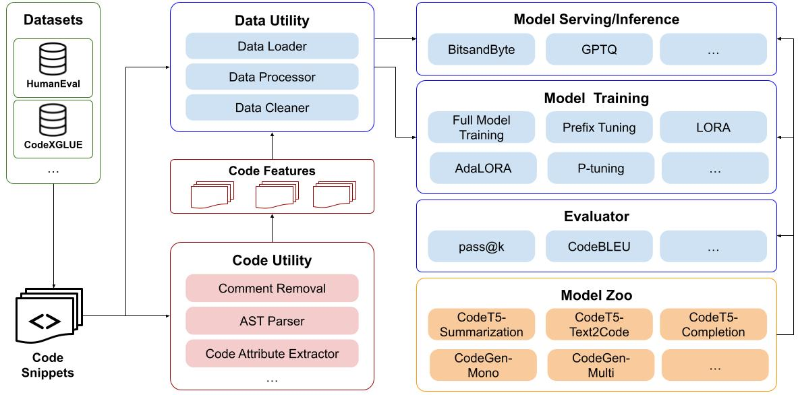

What is CodeTF?
####################################

CodeTF is a one-stop Python library for code intelligence tasks (AI4Code), provides a seamless interface for training and inferencing on code intelligence tasks like code summarization, translation, and generation. It aims to facilitate easy integration of cutting-edge language models into real-world applications.

It features a unified design to access state-of-the-art foundation language models of code (`UniXCoder <https://arxiv.org/pdf/2203.03850.pdf>`_, `CodeT5 <https://arxiv.org/pdf/2109.00859.pdf>`_,
`CodeGen <https://arxiv.org/pdf/2203.13474.pdf>`_, `StarCoder <https://huggingface.co/blog/starcoder>`_, `CodeT5Plus <https://arxiv.org/pdf/2305.07922.pdf>`_), common code intelligence tasks 
(code summarization, code generation, code completion, code refinement, etc.) and datasets (Human Eval, CodeXGLUE, APPS, MBPP, PyMT5, etc.).

This library aims to provide engineers and researchers with a one-stop solution to rapidly develop models for their specific  scenarios, and benchmark them across standard and customized datasets. 

- **Fast Model Serving**: We support an easy-to-use interface for rapid inferencing with **pre-quantized models** (int8, int16, float16).
- **Fine-Tuning Your Own Models with Custom Datasets**: We provide an API for quickly fine-tuning your own LLMs for code using SOTA techniques for **parameter-efficient fine-tuning** (HuggingFace PEFT) on distributed environments.
- **Supported Tasks**: nl2code, code summarization, code completion, code translation, code refinement, clone detection, defect prediction.
- **Datasets+**: We have preprocessed well-known benchmarks (**Human-Eval, MBPP, CodeXGLUE, APPS, etc.**) and offer an easy-to-load feature for these datasets.
- **Model Evaluator**: We provide interface to evaluate models on well-known benchmarks (e.g. Human-Eval) on popular metrics (e.g., pass@k) with little effort (**~15 LOCs**).
- **Pretrained Models**: We supply pretrained checkpoints of state-of-the-art foundational language models of code (CodeBERT, CodeT5, CodeGen, CodeT5+, Incoder, StarCoder, etc.).
- **Fine-Tuned Models**: We furnish fine-tuned checkpoints for 8+ downstream tasks.
- **Utility to Manipulate Source Code**: We provide utilities to easily manipulate source code, such as user-friendly AST parsers (based on tree-sitter) in **15+ programming languages**, to extract important code features, such as function name, identifiers, etc.

.. image:: _static/overview.png
  :width: 600

Supported Tasks, Models 
####################################

The following table shows the supported models with sizes and the tasks that the models support. This is a continuing effort and we are working on further growing the list.

+------------+-------------------+-------------------------------------------+--------------------------------------------------------------------------------------------+
| Model      | Type              | Size                                      | Tasks                                                                                      |
+============+===================+===========================================+============================================================================================+
| CodeBERT   | Encoder           | Base (160M), Small (84M)                  | Pretrained, MLM                                                                            |
+------------+-------------------+-------------------------------------------+--------------------------------------------------------------------------------------------+
| CodeGen    | Decoder           | 350M, 2B, 6B, 16B                         | Pretrained                                                                                 |
+------------+-------------------+-------------------------------------------+--------------------------------------------------------------------------------------------+
| SantaCoder | Decoder           | 1.1B                                      | Pretrained                                                                                 |
+------------+-------------------+-------------------------------------------+--------------------------------------------------------------------------------------------+
| StarCoder  | Decoder           | 15.5B                                     | Pretrained                                                                                 |
+------------+-------------------+-------------------------------------------+--------------------------------------------------------------------------------------------+
| GPT        | Decoder           | j (1.3B), j (6B), Neox (20B)              | Pretrained                                                                                 |
+------------+-------------------+-------------------------------------------+--------------------------------------------------------------------------------------------+
| GPT-Neo    | Decoder           | 1.3B                                      | Pretrained                                                                                 |
+------------+-------------------+-------------------------------------------+--------------------------------------------------------------------------------------------+
| BLOOM      | Decoder           | 560M, 1.1B, 1.7B, 3B, 7.1B                | Pretrained                                                                                 |
+------------+-------------------+-------------------------------------------+--------------------------------------------------------------------------------------------+
| Incoder    | Decoder           | 1B, 6B                                    | Pretrained                                                                                 |
+------------+-------------------+-------------------------------------------+--------------------------------------------------------------------------------------------+
| CodeT5     | Encoder-Decoder   | Small (125M), Medium (220M), Large (770M) | Pretrained, Code Sum, Code Generation, Code Refinement, Defect Prediction, Clone Detection |
+------------+-------------------+-------------------------------------------+--------------------------------------------------------------------------------------------+
| CodeT5+    | Encoder-Decoder   | 220M, 770M, 2B, 6B, 16B                   | Pretrained                                                                                 |
+------------+-------------------+-------------------------------------------+--------------------------------------------------------------------------------------------+

Library Design
####################################

CodeTF has 7 key modules.

### Code Utility
The Code Utility module serves as the foundation of our library, utilizing tree-sitter as the parser for 15 programming languages, such as Java, Apex, C, C++, C#, Python, Scala, SOQL, SOSL, PHP, JavaScript, Haskell, Go, Kotlin, Ruby, Rust, Scala, Solidity, and YAML. It offers utility functions for tasks such as comment removal, extraction of code properties (e.g., comments, variable names, method names), and more. This module ensures the efficient handling and manipulation of code, catering to the unique syntax and structure of each supported programming language.

### Model Zoo
The Model Zoo module provides configurations for both pretrained and fine-tuned checkpoints, encompassing CodeT5, CodeGen, and CodeT5+, which are available on the Hugging Face platform. This module streamlines access to state-of-the-art models for code intelligence tasks, enabling users to utilize these models in their applications. Each model is accompanied by a YAML configuration file containing essential information such as the Hugging Face URL, tokenizer, maximum sequence length, and more.

### Inferencing Module

The Inferencing Module provides users with the ability to load checkpoints from model cards, utilizing pretrained and fine-tuned models for a variety of tasks, such as code summarization, completion, generation, and refinement. This module simplifies the deployment of models for an array of code intelligence tasks by offering a convenient method for conducting inference on new code snippets. CodeTF incorporates CTranslate2, BitsandByte, and GPTQ as diverse quantization choices to accommodate various requirements.

### Training Module

The Fine-tuning Module allows users to load checkpoints from model cards and customize their models using existing datasets. Supporting both full model and parameter-efficient fine-tuning methods, this module enables users to optimize models for their specific use cases. To facilitate parameter-efficient fine-tuning, we utilize PEFT as the backbone, which includes various supported methods such as LORA, Prefix-Tuning, P-Tuning, Prompt Tuning, and AdaLORA.

### Data Utility Module

The Data Utility module provides a suite of tools for data preprocessing, including tokenization, code processing, and data loaders. These utilities ensure that data is appropriately prepared for use in training and inference, promoting efficient and accurate model performance.

### Datasets Module

The Datasets module contains preprocessed datasets that can be conveniently loaded from Hugging Face. This module simplifies the process of obtaining and utilizing code-related datasets, fostering a seamless experience for users who wish to train or fine-tune models on diverse data. We currently preprocessed the HumanEval, MBPP, APPS, and CodeXGLUE and hosted them on Huggingface for ease of use.

### Evaluator Module
We also aim to provide a unified interface that offers a variety of metrics specifically tailored to code intelligence tasks, including but not limited to Pass@K, Edit Similarity, and CodeBLEU. By providing these standardized metrics, we seek to streamline the evaluation process and facilitate

Installation
############
1. (Optional) Creating conda environment

.. code-block:: bash

   conda create -n lavis python=3.8
   conda activate codetf

2. Cloning and building from source

.. code-block:: bash

   git clone https://github.com/salesforce/CodeTF.git
   cd CodeTF
   pip install .

If you would like to develop on CodeTF, you may find it easier to build with editable mode::

   pip install -e .